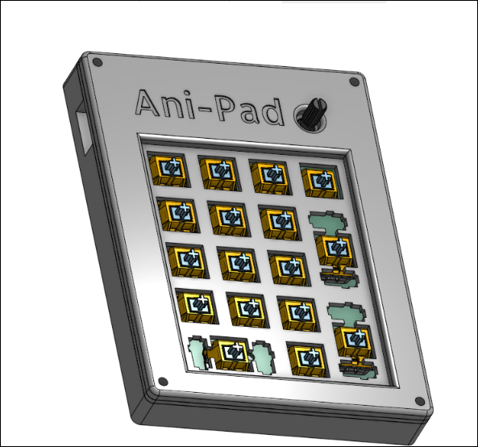
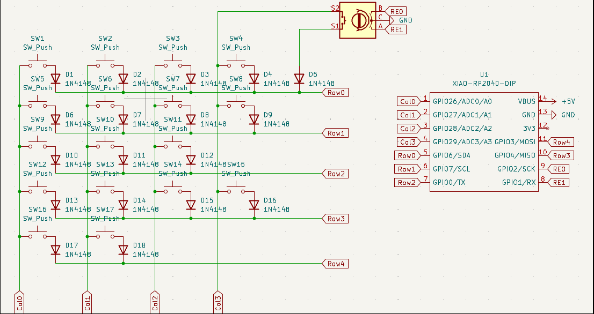
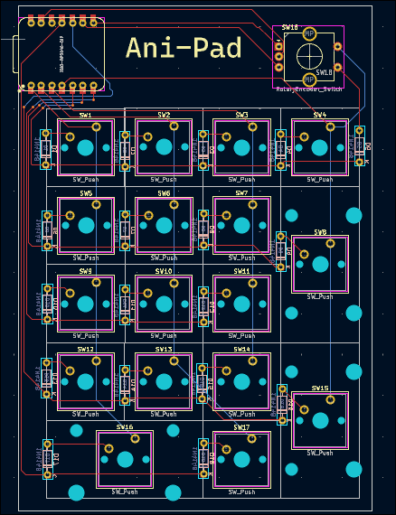
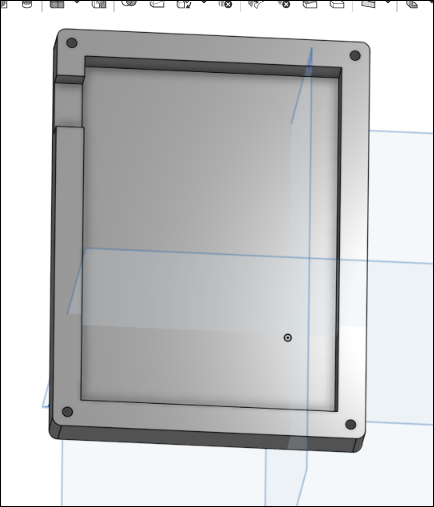
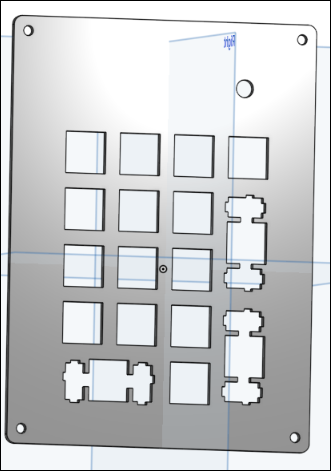
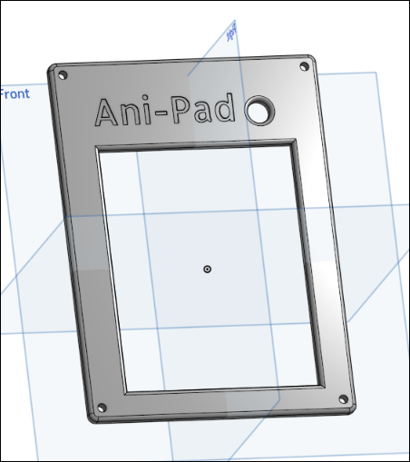
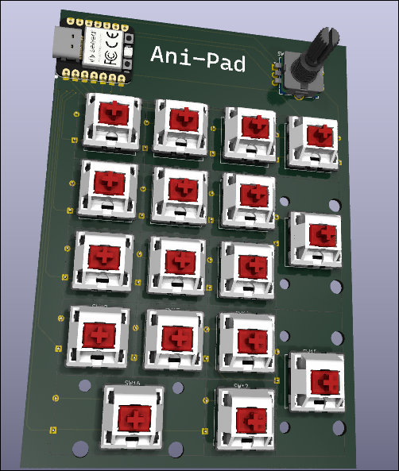
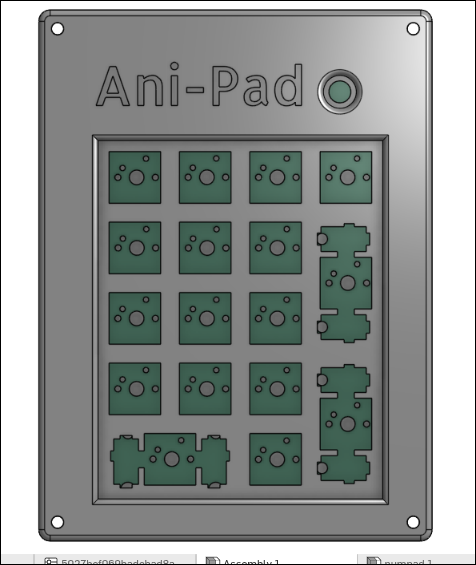
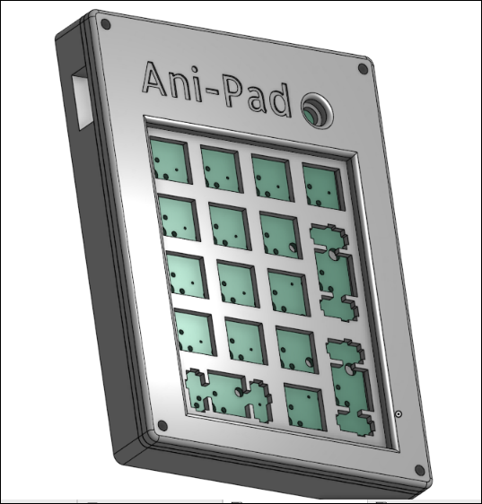

# Ani-Pad

### Why did I make it?
As I already made hackpad So i wanna make sure that this submission is not hackpad
This is a easier project for highway. So, i made this project cause I use a 60% keeb which does not have a numpad and I really needed that so i asked alex can i make one and got a yes so here we go

### What was the hardest part about this ?
I had tons of issues with making the Firmware, I was really fucked up on Firmware part but I made through.

Features:

- EC11 Rotary Encoder - For Volume, Brightness etc
- 17x keys
- XIAO rp2040
- Traditional Numpad Layout
- QMK firmware
  
### Schematic

### PCB 

### Case
- Bottom

-Middle plate

- Top

### 3D view of all parts together 
-PCB

-CAD

### BOM
| Name                                                          | Qty | Final Price - INR (USD) | Link                                                                                                                        |
| ------------------------------------------------------------- | --- | ----------------------- | ----------------------------------------------------------------------------------------------------------                  |
| Gateron EF Grayish                                            | 20  | 390 ($4.55)             | [here](https://neomacro.in/products/gateron-ef-grayish)                                                                     |
| Genuine Cherry MX Plate Mount Stabilizers 2U                  | 3   | 400 {$4.67}             | [here](https://stackskb.com/store/genuine-cherry-mx-plate-mount-stabilizers-2u/)                                            |
| KeyKobo Jindo Keycap Set                                      | 1   | 1,700 ($19.84)          | [here](https://neomacro.in/products/key-kobo-jindo-keycap-set?_pos=3&_sid=b1e2b9343&_ss=r&variant=48328446116118)           |
| Diode 1N4148 Through - Hole                                   | 100 | 169 ($1.97)             | [here](https://amzn.in/d/j3eLvoh)                                                                                           |
| EC11 Rotary Encoder                                           | 2   | 178 ($2.08)             | [here](https://amzn.in/d/hVRxzij)                                                                                           |
| M3 x 20mm Bolt                                                | 15  | 149 ($1.73)             | [here](https://amzn.in/d/8GRQWAB)                                                                                           |
| M3 Nuts                                                       | 8   | 100 ($1.16)             | [here](https://amzn.in/d/7UQtsm8)                                                                                           |
| M3 x 5mm Heatset Insert                                       | 25  | 179 ($2.09)             | [here](https://amzn.in/d/ixybuAc)                                                                                           |
| PCB                                                           | 5   | 2,282 ($26.63)          | 
| XIAO 2040                                                     | 1   | 1,340 ($15.64)          | [here](https://www.amazon.in/Microcontroller-Dual-Core-MicroPython-CircuitPython-Interfaces/dp/B09NNVNW7M/ref=sr_1_2_mod_primary_new?sbo=RZvfv%2F%2FHxDF%2BO5021pAnSA%3D%3D&sr=8-2)|
| Top Case                                                      | 1   | Print Legion            |
| Bottom Case                                                   | 1   | Print Legion            |
| Middle Plate                                                  | 1   | Print Legion            |

## Total Pricing 

This Numpad comes out to be 6887 INR ($80.36) When ordering all the parts I'm not including  the 3D parts because I will be getting them from Print Legion.

## Notes :-

I want all the three 3D-printed parts to be printed in black color.
The pricing might slightly vary due to flash sales, and dollar market trends.
